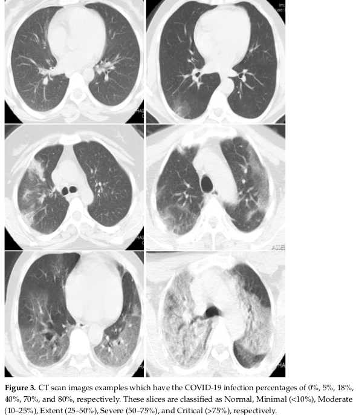

### Per-COVID-19: A Benchmark Dataset for COVID-19 Percentage Estimation from CT-Scans
Covid-19 infection percentage estimation from CT-scans
 
Dataset and Pytorch code for the paper 
[" Per-COVID-19: A Benchmark Dataset for COVID-19 Percentage Estimation from CT-Scans"](https://www.mdpi.com/2313-433X/7/9/189), MDPI, Imaging 2021

[Paper](https://www.mdpi.com/2313-433X/7/9/189) 


## Introduction

COVID-19 infection recognition is a very important step in the fight against the COVID-19 pandemic. In fact, many methods have been used to recognize COVID-19 infection including Reverse Transcription Polymerase Chain Reaction (RT-PCR), X-ray scan, and Computed Tomography scan (CT- scan). In addition to the recognition of the COVID-19 infection, CT scans can provide more important information about the evolution of this disease and its severity. With the extensive number of COVID-19 infections, estimating the COVID-19 percentage can help the intensive care to free up the resuscitation beds for the critical cases and follow other protocol for less severity cases. In this paper, we introduce COVID-19 percentage estimation dataset from CT-scans, where the labeling process was accomplished by two expert radiologists. Moreover, we evaluate the performance of three Convolutional Neural Network (CNN) architectures: ResneXt-50, Densenet-161, and Inception-v3. For the three CNN architectures, we use two loss functions: MSE and Dynamic Huber. In addition, two pretrained scenarios are investigated (ImageNet pretrained models and pretrained models using X-ray data). The evaluated approaches achieved promising results on the estimation of COVID-19 infection. Inception-v3 using Dynamic Huber loss function and pretrained models using X-ray data achieved the best performance for slice-level results: 0.9365, 5.10, and 9.25 for Pearson Correlation coefficient (PC), Mean Absolute Error (MAE), and Root Mean Square Error (RMSE), respectively. On the other hand, the same approach achieved 0.9603, 4.01, and 6.79 for PC_subj, MAE_subj, and RMSE_subj, respectively, for subject-level results. These results prove that using CNN architectures can provide accurate and fast solution to estimate the COVID-19 infection percentage for monitoring the evolution of the patient state. View Full-Text
Keywords: COVID-19; deep learning; convolutional neural network; CT-scans; dataset generation

<p align="center">
  
</p>

### Using the code:

- Clone this repository:
```bash
git clone https://github.com/jeya-maria-jose/Medical-Transformer
cd Medical-Transformer
```

The code is stable using Python 3.6.10, Pytorch 1.4.0

To install all the dependencies using conda:

```bash
conda env create -f environment.yml
conda activate medt
```

To install all the dependencies using pip:

```bash
pip install -r requirements.txt
```

### Links for downloading the public Datasets:

1) MoNuSeG Dataset - <a href="https://monuseg.grand-challenge.org/Data/"> Link (Original)</a> 
2) GLAS Dataset - <a href="https://warwick.ac.uk/fac/sci/dcs/research/tia/glascontest/"> Link (Original) </a> 
3) Brain Anatomy US dataset from the paper will be made public soon !

## Using the Code for your dataset

### Dataset Preparation

Prepare the dataset in the following format for easy use of the code. The train and test folders should contain two subfolders each: img and label. Make sure the images their corresponding segmentation masks are placed under these folders and have the same name for easy correspondance. Please change the data loaders to your need if you prefer not preparing the dataset in this format.


```bash
Train Folder-----
      img----
          0001.png
          0002.png
          .......
      labelcol---
          0001.png
          0002.png
          .......
Validation Folder-----
      img----
          0001.png
          0002.png
          .......
      labelcol---
          0001.png
          0002.png
          .......
Test Folder-----
      img----
          0001.png
          0002.png
          .......
      labelcol---
          0001.png
          0002.png
          .......

```

- The ground truth images should have pixels corresponding to the labels. Example: In case of binary segmentation, the pixels in the GT should be 0 or 255.

### Training Command:

```bash 
python train.py --train_dataset "enter train directory" --val_dataset "enter validation directory" --direc 'path for results to be saved' --batch_size 4 --epoch 400 --save_freq 10 --modelname "gatedaxialunet" --learning_rate 0.001 --imgsize 128 --gray "no"
```

```bash
Change modelname to MedT or logo to train them
```

### Testing Command:

```bash 
python test.py --loaddirec "./saved_model_path/model_name.pth" --val_dataset "test dataset directory" --direc 'path for results to be saved' --batch_size 1 --modelname "gatedaxialunet" --imgsize 128 --gray "no"
```

The results including predicted segmentations maps will be placed in the results folder along with the model weights. Run the performance metrics code in MATLAB for calculating F1 Score and mIoU. 

### Notes:

1)Note that these experiments were conducted in Nvidia Quadro 8000 with 48 GB memory. 
2)Google Colab Code is an unofficial implementation for quick train/test. Please follow original code for proper training.

### Acknowledgement:

The dataloader code is inspired from <a href="https://github.com/cosmic-cortex/pytorch-UNet"> pytorch-UNet </a>. The axial attention code is developed from <a href="https://github.com/csrhddlam/axial-deeplab">axial-deeplab</a>. 

# Citation:

```bash
@article{valanarasu2021medical,
  title={Medical Transformer: Gated Axial-Attention for Medical Image Segmentation},
  author={Valanarasu, Jeya Maria Jose and Oza, Poojan and Hacihaliloglu, Ilker and Patel, Vishal M},
  journal={arXiv preprint arXiv:2102.10662},
  year={2021}
}
```
